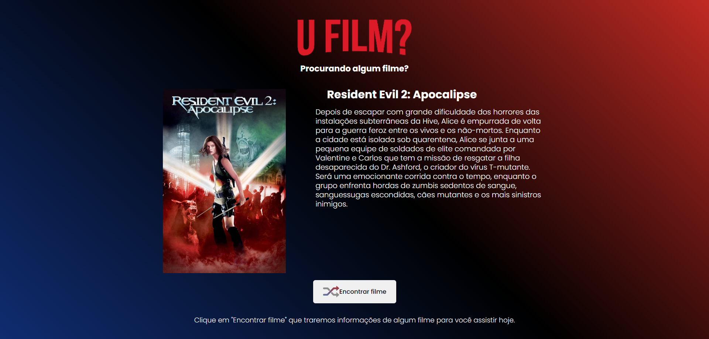

<h1 align="center"> <b>U Film</b> </h1>

  

Projeto de consumo de API com AXIOS do The Movie DB para recomendar filmes  

  <a href="#-tecnologias">Tecnologias</a>&nbsp;&nbsp;&nbsp;|&nbsp;&nbsp;&nbsp;
  <a href="#-projeto">Projeto</a>&nbsp;&nbsp;&nbsp;|&nbsp;&nbsp;&nbsp;
  <a href="#-layout">Layout</a>
 

 

  

## 🚀 Tecnologias

Esse projeto foi desenvolvido com as seguintes tecnologias:

- JavaScript
- Axios
- Git e Github

## 💻 Projeto
- [Projeto Finalizado](http://condmanager.live/)

Feito com ♥ by Gabriel
